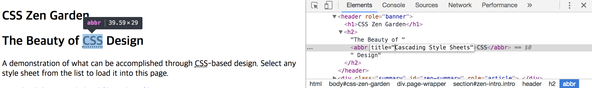
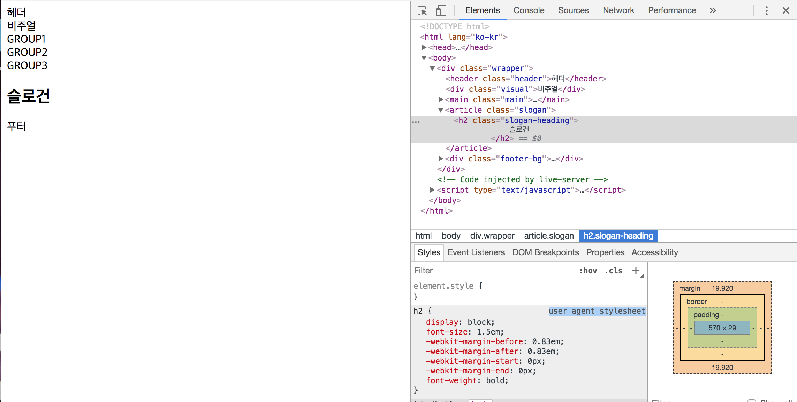
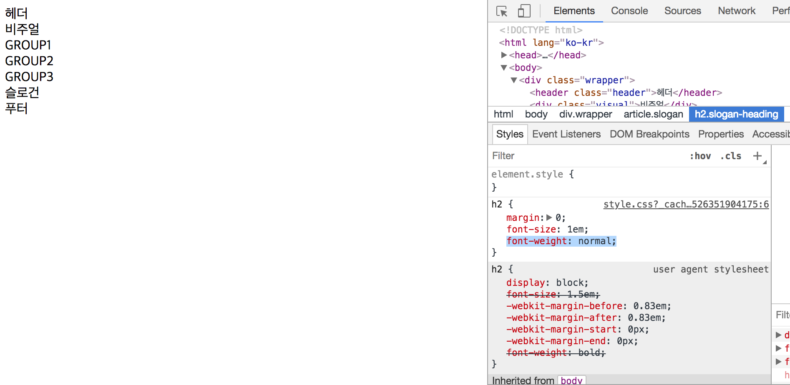

# 2주차-180515(화)

* git pro manual을 배워라

## [ 1 ] CSS
- CSS에서 가장 중요한 코드를 꼽으라면 박스모델.

이전까지 테이블 위에다가 이미지를 올림. 테이블의 의도를 오용하는 것

## css의 역사
- 1996년 w3c의 주도 하에 첫 번째 css 버전인 level 1이 발표
- 1998년 css level2부터는 ms가 적극적으로 필요한 것을 요구
- css level3는 level2와는 달리 모든 명세가 포함된 버전이 아닌 **모듈 단위**로 개발되고 있음. 단일한 스펙이 한꺼번에 올라가야하는데 불가능하기 때문에 모듈단위로 발전시킨 것. 스펙면에서 css3이지는 않으나 마케팅적인 방면에서 css3라고 하는 것.

* css 공식 표준 문서
https://www.w3.org/Style/CSS/
'working-draft -> propose -> recommendation'의 단계로 권고안이 확정됨 올라갔다가 내려갈 수도 있음. rec는 권고안. (지금은 브라우저 제조사가 먼저 기능을 만들어서 지원하면서 draft를 나중에 올림. 권고안이 없으면서 브라우저가 기능을 가지고 있는 경우도 있음)

https://www.w3.org/Style/CSS/current-work
CSS Backgrounds and Borders Level 4	: 굉장히 전통적인 기술. 하지만 다양한 모듈이 증가하면서 배경과 테두리를 재정의하게 됨. 그래서 다시 내려온 것.

---
## 웹 브라우저별 css3지원 test
http://css3test.com/
firefox는 67%, chrome은 60%가 일치하는 것을 볼 수 있다.
sfari, opera, explore 등 여러 브라우저에서 테스트를 해야 한다. 

chrome에서 Flexible Box Layout-flex-basis-content 빼고는 다 지원하는 걸 확인 할 수 있음.


---
## test를 쉽게 해주는 사이트

can I use ___ ?

https://caniuse.com/#search=flex

1차 확인용. 데스크탑만 보여주는 것이 아니라 Android, Samsung internet, IOS Safari 등 대표적 모바일도 볼 수 있다. 또한 버전별로 지원 리스트도 확인 할 수 있다.

---
## css 사용의 의의
css는 스타일링을 하는 언어.최대한 분리할 수 있는 방법을 고민해야한다. 

_'구조와 표현의 분리'_

_one source, multi use_

---
## 좋은 코드 볼 수 있는 사이트
http://csszengarden.com/를 구조적으로 살펴보자. 고전적이지만 다양한 아이디어를 얻을 수 있음.

- 메인화면

  webdeveloper확장프로그램-css-disabile을 이용해서 어떤 태그로 마크업했는지 보자. 
  the beauty of CSS design에서 보면 CSS가 무엇의 약어인지 알려줄 수 있도록 <abbr>태그를 달아서 알려주는 것. 

  


http://www.mezzoblue.com/zengarden/alldesigns/
  재미있는 사이트. html을 가지고 이런 창의적인 프로젝트를 했어 뽐내는 사이트

http://www.csszengarden.com/213/
  디자인을 빼고 보자. h1태그로 했는데, 백그라운드 이미지로 이미지로 넣은 것을 확인할 수 있다.

http://www.csszengarden.com/057/
  사이드바에 반투명하게 나온다. explore는 반투명을 제공하지 않는데, 어떻게 이것을 우회했는지를 살펴볼 수 있다. explore에서 보면 메뉴가 쫙 펼쳐져서 나온다. 크로스브라우징은 다른 환경에 사용하는 사용자가 사용하는데 불편함이 없도록 도와주는 것이니 완벽하게 같은 디자인이 아니다. 똑같이 만들어야지가 아니라 모든 환경에서 접근, 사용가능해야지라고 생각해야 한다. 어떤 방식의 최적화를 할 것인지에 대한 고민.

  에릭마이어, 션 인맨 등 좋은 코드가 많다. 공부해 볼 것.

---
## 기본문법
css는 크게 선택자selector와 선언부delaration block로 이뤄져있다. 선택할 떄는 어떻게 호출할 것인지 고민해야 한다. 

  selector {
    property : value ;
    property : value
  }

html의 attribute(.)와 css의 property(:)는 다르다(스펙에 나와있는 용어 그대로 공부할 것.)

---
## 실습


    <article class="slogan">
        <h2 class="slogan-heading">
            슬로건
        </h2>
    </article>



중간에 슬로건 위아래로 여백이 생긴 것을 볼 수 있다. 각 에이전트가 가지고 있는 성질?을 알아놔야한다. 
    

그런데 브라우저별로 에이전트 해석이 달라질 수 있다. 사용서와 똑같은 결과가 나오지 않는 것. 사용자층이 아직 남아있는 브라우저가 100개가 넘지만 



아래쪽에 -webkit-margin-bottom이 뭘까? 해당 브라우저에서만 동작하는 agent style. 벤더에 따라 붙는 접두사가 다르다.
  microsoft는 -ms-
  firefox, mozilla는 -moz-
  opera, chrome, safari, 모바일에 탑재된 인터넷을 사용하는 것은 -webkit-  

h2 태그가 디자인적으로 예쁘지 않다는 이유로 제목에 해당하는 것을 div를 사용해서 마크업하는 경우가 많다. h2를 사용해도 얼마든지 커스터마이징할 수 있다. 디자인적인 이슈는 나중에 처리하고 내용에 따라 구조적 설계를 먼저 해라.

굵게 강조되고, 위아래 여백을 없애기 위해서 또다른 \<h2>의 css를 만들어보자.

  h2{
    font-size: 12m;
    font-weight: normal;
  }

스타일 시트 h2태그에 대한 것이 두개가 있다. 위에는 재적용한 코드가 위에 올라간 것. css는 선언한 모든 것이 중복되어 적용함(cascade) 그렇게 케스캐이딩된 코드는 개발자모드로 확인해보면 중복되어 줄로 지워져 있다. 그래서 css는 하나하나씩 추적해나가면서 오류를 잡는 수 밖에 없다

https://developer.mozilla.org/ko/docs/Web/CSS/Cascade

---
## [ 2 ] Box Model

block, inline 모두 박스로 나타난다. 

## 1. block box
  브라우저 안에서 부모영역만큼 크기를 가지고 자리를 차지한다

## 2. inline box
  콘텐츠만큼 배치되는 박스. 대표적인 것이 텍스트. 텍스트는 자리가 모자라면 다음줄로 흘러가서 배치되다. 눈에 보이지는 않지만 텍스트역시 익명의 흘러가는 인라인박스.

---

기본적인 박스는 content영역만큼 제공. 그러나 인라인인지 블럭인지 알 수 없다. 테두리가 0이기 때문에. 그러나 border를 주면 박스형태인 것을 확인핤 수 있다. 

마진은 투명하다. 그래서 마진병합현상이 일어나기도 한다.


box-sizing : content-box 방식(모두 더함)
             border-box 방식(width에 padding, margin이 포함)

반응형의 목표 모바일에 대응하기 위해
모마일마다 가지고 있는 뷰포트 크기가 다르기 때문.
그래서 100%로 준다.
그리드적인 관점에서 컨텐츠를 중앙에 배치하고 양옆에 여백값(마진, html의 마진과 다름)을 주려한다. division을 두번 wrapping한다. 부모영역에는 100% width를 주고 자식은 width auto를 주고 margin을 20씩 주면 된다. 

그런데 모더박스 방식을 사용해서도 처리할 수 있다.
padding-lefg,right를 20px을 준다. 백분율이 알아서 계산해줘서 레이아웃이 좀 더 쉽다.

박스사이징에 따라서 코드가 달라져야 한다. 

block coneecting inspect
글자가 작아지지는 않았으나, 

* margin : auto 은 내가 가진 만큼, 부모에게로부터 할당된 것에서 남은 여백을 반대편에 배치한다. 그러나 박스

box-sizing:border-box;을 지정해주지 않으면
기본적으로 box-sizing:content-bax인 것을 확인 할 수 있다.
대부분의 요소가 이런데, 이렇지 않은 요소들도 있다.

맥, 윈도우에 따라 또 다르게 해석하는 것. 

DOM Tree 
  domㅢ 지도를 그려놓으면 

reflow : 나누는 작업
repaintign : 
feflow를 re
나중에 선언한게 나중에 칠해져서 그색만 보이는 것.

마진은 일반적인 흐름normal flow대로, 마크업 순서대로 배치가 된다. 마진이 합쳐진 병합현상. 투명해서. normal flow를 벗어나는 순간, 그리드박스, 플렉스박스를 쓰는 순간 합쳐지지 않는다. 

의도가 있다 마진 병합은
등간격으로(같은 간격으로) 요소를 배치하기 위해서 생긴 것.

height : 10vh;
  viewport의 10%라는 뜻. 


---오후

선택자의 그루핑 : 래퍼부터 푸터까지 같은 넓이를 조정하는 법

.header, .visual, .main, .slogan, .fooer{

 }

---
## float

normal flow를 벗어나서 떠있는 것.
left, right밖에 없다

line box 안에서 왼쪽, 오른쪽
부모영역의 크기 안에서 붕 떠서 왼쪽 또는 오른쪽으로 배치되는 것. group1이 float처리가 되어 붕 뜨니까 2,3번만이 normal flow로 적용되어서 둘밖에 자식요소가 없는것처럼 됨.

   background-color: rgba();
   
   레벨 2부터 됨. 16준수. 맨뒤의 알파는 투명. 1이 

float되면서 인라인박스 크기가 조절되고 있음. 그리고 박스크기를 지정해주지 않았으니 텍스트만큼만 자리를 차지하는 것.

bfc(block f)

 .group1{
   background-color: rgba(255, 255, 255, 0.5);
   float: left;
 }

 .group2{
   background-color: teal;
   float: left;
 }

 .group3{
   background-color: tomato;
   /* float: right; */
 }

이렇게 하면 마치 3번이 밀려난것 같다. 겹쳐있는데 그 안에 담겨 있는 인라인컨텐츠는 밑으로 겹쳐있지 않음. float는 떠있으면서 그 밑에 다른 것이 있지 못하도록 밀어놓음. float가 만들어질 시점만 해도 이미지를 감싸는 텍스트정도만 필요했기 때문

---

색상체계 : 사람이 인지하기 쉬운 색상체계(레벨3부터 이런 함수들이 사용가능)
  background-color: hsla(hue0-360도, saturation, lightness, alpha);
  background-color: hsla(120, 70%, 50%, 1);


float를 해체하는 것. both/left/right를 사용해서 양쪽/왼쪽/오른쪽의 float를 해체. 겹쳤던 것만큼 마진을 추가하는 것. block에만 사용할 수 있음.
   clear: both;

전통적인 레이아웃 기법. 대부분의 브라우저가 지원하는 것은 float밖에 없다. 

만약 g3, g1, g2의 모양으로 마크업하고 싶다면 이중 float기능을 하면 된다. 

main은 블록박스의 높이만큼 들어나야 하는데 group이 float처리가 되었기 때문에 나타나지 않는 것. float의 높이를 포함해서 부모가 늘어나게 해야함.
```
 .main{
   background-color: skyblue;
   height: 30vh;
   overflow: hidden; //
 }
```
overflow : 독립된 bfc 영역을 만들어주는 역할. 붕떠있는 자식까지 포함해서 새로운 flow영역을 만든다. 그러나 단점이 있다. 
```
 .group1{
   background-color: rgba(255, 255, 255, 0.5);
   float: left;
   position: relative; //
   left: -20px; //
 }
```
넘치는 영역이 생기면 숨겨줘! 라는 의미이기 때문에 다른 속성을 조합했을 때 문제의 소지가 있다 그래서 overflow : hidden을 별로 권장하고 싶지 않음. 

--오후2 수업시작

overflow : hidden/auto/scroll; 
이떻게 동작하는지를 이용해서 float이슈를 해결할 수 있다. 

zoom속성을 부모인 main에게 주면, 
부모를 확대하거나 축소하려면 안에 있는 자식들을 다 읽어야 한다.

overflow 넘치는 영역을 체크하려면 가로세로를 체크해야한다. 그런 역할때문에 float이슈가 해결되는 것처럼 여겨지는 것.

이것보다 안전한 방법을 사용해보자.
1)clearfix로 빈 div를 넣어서 해결한다. 
그런데 디자인적인 부분 때문에 쓸데없이 마크업이 지저분해짐. 그런데 현업에서 제일 많이 쓰는 것.

\<div class="claerfix"></div>
```
 .clearfix{
   clear: both;
 }
```
2)main영역을 float로 처리하는 방법(부모에게 플롯값 따로 지정하기)
 .main{
   background-color: skyblue;
   float: left; //
 }
 자식까지 포함해서 붕 뜨게 됨. 그런데 자식요소까지 읽는데는 성공했지만 오토마진이 무시됨. 마진 동작원리가 우리가 의도한 것처럼 되지 않음. 그래서 이것도 별로.. 플롯값 지우자

 3)::before, ::after를 사용하자

::before를 사용해서 mian의 가상의 first child, last child를 만들 수 있다. inline성격을 띈. 
::가상요소선택자. 가짜로 만들기 위해서 만드시 content 속성을 함께 써야함 
```
 .main::before{
   content: "첫번째 자식 요소";
   background-color: gray;
   color: white;
 }
 ```
 인라인요소다. 색을 칠해보니 딱 글자까지만 칠해지는 것으로 알 수 있음. 컨트롤 a로 눌러보면 "첫번째 자식 요소"는 선택되지 않는데 phantum 컨텐츠인 것을 확인할 수 있다.
 (:before도 결과는 동일하게 나오나..)


  .main::after{
   content: "마지막 자식 요소";
   background-color: black;
   color: white;
   clear: both;
 }
 먹지 않음. 블록에만 클리어가 먹어서. css 문법검사 돌려보자 css 디자인은 다른 곳에 사용될 때는 무시되고, 블록에만 사용됬을때 적용되는 알고리즘으로 만들어져 있다. inline상자인것을 확인해보자. 검색해보면 display : inline인 것을 확인할 수 있다. 이 속성을 바꿀 수 있다. 
 ```
  .main::after{
   content: "마지막 자식 요소";
   background-color: black;
   color: white;
   clear: both;
   display: block;  // 대신 display: table을 쓰기도 한다. table도 block이기 때문
 }
 ```
 ```
  .main::after{
   content: ""; //텍스트를 null값을 줌
   background-color: black;
   color: white;
   clear: both;
   display: block;
 }
 ```
 가상요소를 이용하는 방식이 float를 해결하는데 가장 많이 사용됨. 자주 사용하는 패턴들을 독립적으로 모듈화 해서 빼놓음.

  .clearfix::after{
   content: "";
   background-color: black;
   color: white;
   clear: both;
   display: block;
 }

     <main class="main clearfix">
클래스 이름에 clearfix 추가한다

(부트스트랩은 css전처리방식으로 돌아가고 있음. 그리고 부트스트랩3에는 가능하나, 부트스트랩4부터는 다른 걸 사용함. framework 어떤 범위까지 적용할지 고민.)

* 복습할 추천 사이트
http://naradesign.net/wp/
http://naradesign.net/wp/2008/05/27/144/


--다시 구조를 짜보자 

크기가 부족하면 밑으로 내려가게 됨.
group1,2,3에 각각 width값을 준다.

버그리포트.

마진으로 처리하자 g1에 margin을 양쪽으로 15로 주자.-> 균등하게 주면 어느위치에 있어도 여백간격은 같음. 그러나 g1의 왼쪽, g3의 오른쪽이 15씩 모자라다. ->그러면 부모요소의 안쪽 right, left에 15씩 주는것. -> 튀어나감!! 왜?? -> 늘어난 것. content box 방식... -> 모든 박스모델을 border-box로 쓰자!! -> 기본박스 세팅을 바디요소보다 먼저 전체선택자를 해주자


---

이어서 배치를 해보자
오늘 배치 기법중에 하나를 더 해보자
modern 기법중에 하나인지 flex-box를 해보자
```
[flex.css]
*, *::before, *::after{
  box-sizing: border-box;
}

body{
  background-color:#FFF;
  font-size: 16px;
  margin: 0;
}

h2{
  margin:0;
  font-size: 16px;
  font-weight: normal;
}

 /* 레이아웃 */
 .wrapper{
   background-color: yellow;
 }

 .header, .visual, .main, .slogan, .footer{
  width: 940px;
  margin: 0 auto;
 }

 .header{
   background-color: pink;
   height: 10vh;   
 }

 .visual{
   background-color:  lime; 
   height: 10vh;
 }

 .main{
 background-color: skyblue;
 }

 /* .main::before{
   content: "첫번째 자식 요소";
   background-color: gray;
   color: white;
 } */

 .clearfix::after{
   content: "";
   background-color: black;
   color: white;
   clear: both;
   display: block;
 }

 /* .clearfix{
   clear: both;
 } */

 .group{
   height: 30vh; 
 }

 .group1{
   background-color: rgba(255, 255, 255, 0.5);
   width: 250px;
   /* float: left; */
 }

 .group2{
   background-color: hsla(120, 20%, 60%, 0.5);
   width: 380px;
 }

 .group3{
   background-color: tomato;
   /* float: right; */
   width: 190px;
 }
 .slogan{
   background-color:  blueviolet; 
   height: 10vh;
 }

.footer-bg{
   background: #000;
  }
  
  .footer {
    height: 10vh;   
    background-color: silver;
 }
```

 여기서 그룹들을 가로로 정렬해보자
 display : flex를 이용해서 내부적 속성을 변환
```
  .main{
 background-color: skyblue;
 display: flex; //
 justify-content: space-evenly; //
 }
 ```
 여기저기 다변화해서 배치할 수 없다는 단점이 있음
 -> grid모듈이 다음 대안으로 나옴. 그리드는 explore11이 제대로 지원하지 않음. edge이상부터 쓸 수 있다. 국내에서 바로 도입하기 무리가 있는 방식.

 플렉스를 사용할 때
  display : flex; 
    (를 사용하면 기본적으로 flex-direction:row값이 기본으로 넣어진다. 어떤 방향으로 배치가 될지 결정하는 것. row / column)
```
   .main{
 background-color: skyblue;
 display: flex;
flex-direction: column;
 /* justify-content: space-evenly; */
 }
 ```
 메인 축이 y축으로 흘러가도록 변한 것. 내가 만든 블록박스들이. 

 ```
  .group3{
   background-color: tomato;
   /* float: right; */
   width: 190px;
   order: -1; //
 }
 ```
 order를 사용함. 위에서 아래로, 왼쪽에서 오른쪽으로 흐른다. 지정하지 않으면 모두 순서가 0번인데 오더값을 -1로 주었기 때문에 먼저 온 것

```
.main{
 background-color: skyblue;
 display: flex;
flex-direction: column;
flex-direction: row;
flex-wrap: wrap  //
 /* justify-content: space-evenly; */
 }
```
 줄바꿈을 허용하고 싶을 때는 플렉스 랩

 --
 /* flex-direction: row; */
/* flex-wrap: wrap */
-> 축약형 flex-flow: row wrap;


---
flex-direction : row -> 왼, 오를 start, end라고 부른다. 
                 row-reverse -> 왼, 오가 end, start가 된다

                 column도 마찬가지.

--
justify-content: space-evenly;
메인축을 정렬함


--우회해보자
flexbox game
https://flexboxfroggy.com/#ko

* 깃 공부
1. 간편안내서 : https://rogerdudler.github.io/git-guide/index.ko.html
2. 프로깃 : https://git-scm.com/book/ko/v1/%EC%8B%9C%EC%9E%91%ED%95%98%EA%B8%B0

* css 익히는 법
http://ko.learnlayout.com/ 먼저 연습 계속 연습
