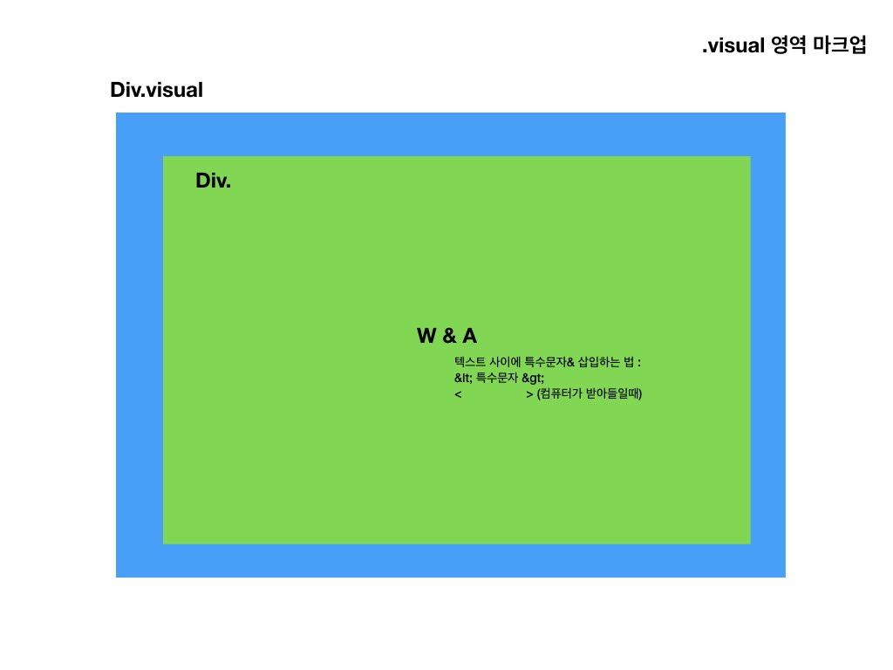
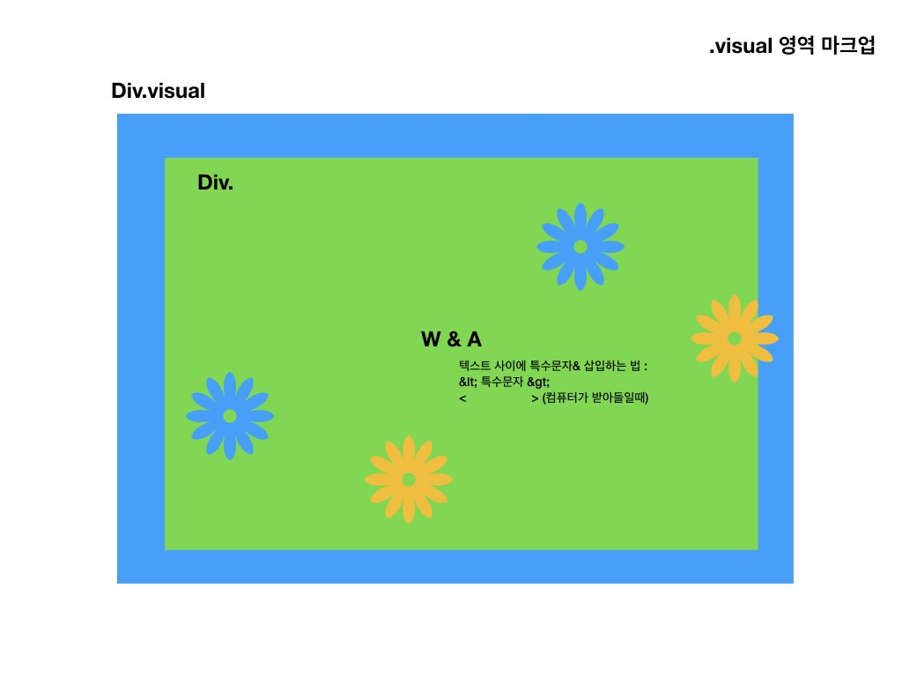

#2주차-180518(금)

## float, inline-block, flex
- float, inline-block : x축으로 배치되거나, y축으로 배치하는 것만 가능
- flex : 전체적인 컨테이너 안에서 배치가 된다

## Grid
- 사용하기 편하다.
- 인터넷 익스플로어 11이 지원하지 않음.
- 국내에서는 사용하는 사례가 적음. 

_어떤 것이 정답이다 보다는 어떤 방법론을 선택할 것인지의 문제_

Animation

* 현업
고민도 안하고 오로지 img로 삽입해서 img태그를 삽입해서 애니메이션 만들어서 img태그에 적용한다.

틀린 것은 아닌데, img가 컨텐츠의 의미를 가지지 않는다. 깔끔한 구조가 나오지 않음. 그래서 이미지를 굳이 마크업에 넣지 않고 싶다. css만으로 가능하기 때문에. 그래서 text 컨텐츠만 담을 것이다

* 특수문자 태그에 삽입하는 법
https://www.w3schools.com/html/html_entities.asp
html에 공백문자, 특수문자를 입력하는 법
적어도 이런 정도는 꼭 변환시키라는 것. <>, &, 파운드, 유로화, 카피라이트 기호..
특수문자를 입력한 것과 문자표에서 찾아오는 것은 다르다. entity name, entity number 둘다 사용가능한데 이름을 넣는게 식별하기 쉽다. 



---
## 애니메이션 적용

1. 애니메이션 선언
원하는 애니메이션을 선언하는 과정이 필요하다 

@keyframes 애니메이션이름

* @ 붙일 때
스타일시트에서 **첫줄** 인코딩 선언 할 때 : @charset "utf-8";
import
animation


2. 애니메이션 내용
애니메이션은 시작(from, 0%)과 종료과정(to, 100%)이 필요하다
```
@keyframes textAni {
  from { css }
  to { css }
}
```
혹은 
```
@keyframes textAni {
  0% { css }
  50% { css }
  100% { css }
}
```


3. 시나리오 설계

- 텍스트 이동 효과
- 텍스트 투명 -> 불투명
- 텍스트 크기 점점 크게

기능으로 바꾸면

- translate / position: absolute / margin, padding
- color : rgba()(배경 및 텍스트만 투명) / opacity(상자 자체가 투명)
- font-size

애니메이션관련 다양한 프레임워크가 있는데 상대적인 단위(em,rem)보다 절대적인 단위(px) 사용을 권고


4. 호출
visual text 선택자에서 사용하고 싶다 -> name, duration 꼭 함께 써줘야 한다. 
```
.visual.text{
  background-color: yellow;
  font-family: Georgia, 'Times New Roman', Times, serif;
  animation-name: textAni; //호출
  animation-duration: 3000ms; //실행시간
}
```
animation-fill-mode: forwards;
어떤 모드로 채울 것이냐 : 끝난 지점;

* 이동 효과를 만들어보자

1)margin 을 사용하니 동작될 때 상자가 늘어난 것 같음 -> padding으로 사용

2)positino:absolute 
---
# 애니메이션 이슈

그래픽 지오메터리. 브라우저 영역에서는 reflow영역 : 얼만큼의 크기로 레이아웃을 배치할 것인지
width, height... 
이것을 칠하는 것을 렌더링 관점에서는 repaint

지금 사용한 padding은 브라우저 관점에서 좋은 방법은 아니다.영역을 만들고 칠하고, 만들고 칠하고를 반복함. 성능을 끌어올리면서 하는 방법을 고민해야 한다.

성능적인 측면을 고려하면서 애니메이션을 설계해보자

textAni{
  animation
  transition
  transform
}

2D function
translate(x),(y) //이동하는 함수
rotate
skew
scale


---

transition timing function
https://www.the-art-of-web.com/css/timing-function/


애니메이션 타이밍 수치 만들기.
http://cubic-bezier.com/#.17,.67,.83,.67
animation-timing-function: cubic-bezier(0,-0.6,.83,.67);


  animation: textAni 1000ms forwards infinite alternate cubic-bezier(0,-0.6,.83,.67) 2s;

---
## 다중배경 사용하기 multi-background

가짜로 상자를 두개 만들 것.

visual : relative
visual::b-before{
  content: "null"
} //익명의 인라인박스 생성됨. 
visual::b-after{
  content: "null"
}

background가 

---
## 접근성

http://wah.or.kr/Participation/guide.asp

웹서비스는 누구나 접근할 수 있도록 해야 한다. 그래서 w3c산하의 WAI에서 가이드라인을 만들었음 WCAG. 이 가이드라인을 바탕으로 한국적 가이드라인. KWCAG. 그러나 돈이 안된다는 이유로 한국에서는 완화된 KWCAG도 잘 지키지 않는다.

웹 개발자라면 이 네가지 가이드라인에 맞춰서.


1. 인식의 용이성

1)텍스트 이미지, 사진 등의 대체 텍스트
시각 장애인이 이용할 수 있도록.

2)자막제공
영상정보를 제공할 때 가장 중요. 동영상에 자막과 수화 동시 제공 / 동영상에 충실한 원고를 제공

3)색에 무관한 컨텐츠 제공
색 말고도 다른 정보를 함께 제공해야 한다. 가령 다른 패턴만으로도 구분 가능하게 해야한다. 가장 좋은 사용자 경험은 사용자에게 고민하지 않게 하는 것. 직관적으로 이해할 수 있게 하는 것. 개발자는 ux도 고민해야 한다.
전경칼라 대비를 사용할 때 16:1정ㄷ로 써야 한다. 그러나 확대축소를 할 수 있을 경우 3:1까지도 허용된다.

4)동영상 자동 재생 차단

5)콘텐츠간의 구분

6)키보드 사용보장
touch evet, key evet, .. 등등 누구나 접근할 수 있도록.
자스 블러처리 하는 순간 키보드 터치 이벤트 모두 날아간다. 블러처리 하는 순간 누군가는 이용하지 못한다. span태그는 키보드 접근 못한다. 되도록이면 용도에 맞는 명령어, 어디를 네비게이션하는지 알 수 있도록


2. 운용의 용이성

ㅊ우분한 시간을 줘야 한다. 

3. 이해의 용이성
4. 견고성

각각 케이스 별로 어떻게 대응하면 좋을지.
이 케이스를 피하는 것만으로도 누군가에는 차별받지 않을 수 있다. 

네이티브가 아님에도 네이티브 앱처럼 패키징하는 것. 
안에 있는 건 웹이기 때문에 접근성을 준수해야 한다.
서드파티들도 준수해야 한다. 

야무. AOA. Accessibility Open Academy