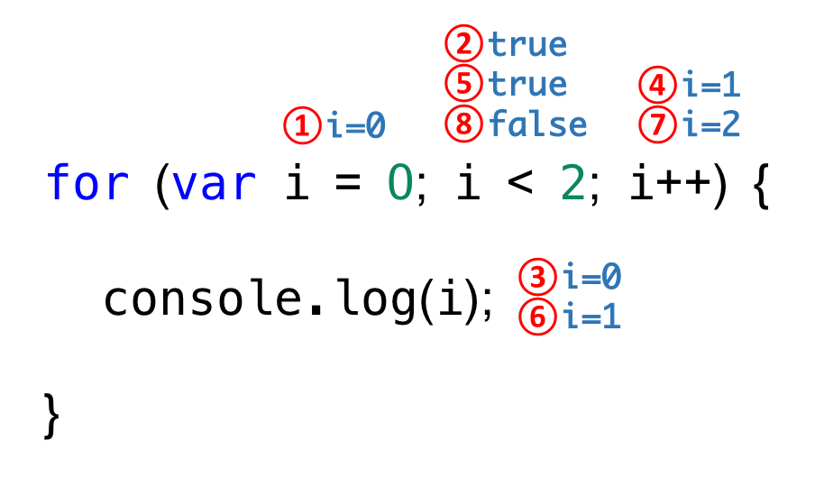

# 4주차 - 180529(화)

## 키워드(Keyword)

키워드는 수행할 동작을 규정한 것이다. 

---
## 주석(Comment)

현대에 프로그래머에게 중요한 것은 퍼포먼스보다 가독성이다. 읽기 좋은 코드가 좋은 코드이다. 
(코드를 잘 읽기 위해서는 탄탄한 문법 + 남의 코드를 많이 읽어봐야 한다.)

주석이 없어도 이해가 잘 되는 것이 좋은 코드이다.(코드는 계속해서 바뀌는데 주석을 같이 바꾸지 않는 경우가 많음)

코드리뷰를 할 때 왜 이렇게 짰는지 말할 수 있어야 한다. 회사에서 하는 프로젝트는 납기일을 맞추는 것이 일번이다. 품질은 그 다음. 일단 약속을 지키는 것. 학생 때 프로젝트는 실습의 목적.

---
## 자료형과 변수(Data type and Variable)

프로그래밍은 
>변수를 통해 값을 저장하고, 참조하며 / 연산자로 값을 연산, 평가하고 / 조건문과 반복문에 의한 흐름제어로 데이터의 흐름을 제어하고 / 함수로 재사용이 가능한 구문의 집합을 만들며 / 객체, 배열 등으로 자료를 구조화 하는 것.


변수는 
>위치, 주소를 기억하는 저장소이다.

위치란 메모리 상의 주소, address를 의미한다.
즉, 변수란
>메모리 주소(Memory address)에 접근하기 위해 사람이 이해할 수 있는 언어로 지정한 식별자(identifir)이다.
(주소를 식별할 수 있다는 의미)

자바스크립트 엔진이 기억하고 있는 것. (엄밀히 말하면 자스 엔진이 OS에게 부탁하는 것.)

변수 선언하는 순간 자스는 메모리를 초기화.->
값을 할당->
값의 재할당할 경우 새로운 메모리에 값을 할당하고 메모리 주소를 바꿈. garbage collection 이 쓰레기 메모리를 지워줌.

변수를 통해 메모리에 값을 저장하기 위해서는 먼저 확보해야 할 메모리의 크기(byte)를 알아야 한다. 값의 종류에 따라 확보해야 할 메모리의 크기가 다르기 때문이다.이 때 값의 종류, 데이터의 종류를 자료형(Data Type)이라 한다.

C나 Java 같은 C-family 언어는 Static Typing(정적 타이핑)언어로 변수 선언 시 변수에 저장할 값의 종류에 따라 자료형을 지정(Type annotation)해야 한다.

자바스크립트는 Dynamic Typing(동적 타이핑)언어로 자료형 지정(Type annotation)이 필요 없이, 값이 할당되는 과정에서 자동으로 변수의 자료형이 결정(타입 추론, Type Inference)된다. 따라서 같은 변수에 여러 자료형의 값을 할당할 수 있다.

---
## 자료형(Data Type)

자료형은 프로그래밍 언어에서 문자열, 숫자, 불리언 등 여러 종류의 데이터를 식별하는 분류를 말한다. 

undefined는 초기값이 없다, 값을 할당한 적이 없다.
null은 값을 앞으로 할당하지 않을 것이다
->참조 정보를 제거할 때 null을 할당하지, undefined를 할당하지는 않음.
->null을 할당하면 자스 엔진은 참조가 없어진 메모리 영역에 대해 가비지 콜렉션을 수행한다.

**주의할 것** null값을 가진 변수를 typeof를 해보면 null이 아닌 object가 나온다. 설계상의 오류. 따라서 변수가 null 타입인지 확인할 때 typeof연산자를 사용하면 안되고 일치 연산자(===)를 사용하여야 한다.

var만 호이스팅 가능. let, const는 hoisting되지 않음.

---
### Number
  컴퓨터가 정수형, 실수형 데이터를 다루는 방식이 다르다. 10을 써도 10.0으로 인식한다. 자스에서는 모든 숫자가 실수다. 에크마 스크립트 표준에 따르면, 숫자 자료형은 배정밀도 64비트 부동소수점 형 단 하나만 존재한다.

  -(2의 53승 -1)~(2의 53승 -1) 보다 크거나 작으면 infinity. 그래서 infinity에도 음수 양수가 있다.

---
### String
  타 언어는 string을 기본자료형으로 취급하지 않는다. 몇 바이트를 배정해야할지 모르기 때문. 때문에 string을 지정했을 때 독특하게 움직인다.
  html/css는 일반적으로 ""
  JavaScript는 일반적으로 ''

  C-family언어와는 다르게 자스의 문자열은 기본자료형으로 변경이 불가능하다. 기본자료형은 한번 세팅된 값을 바꾸지 않는다. 바꿀 수 없다.(immutable) **다른 메모리를 확보하고, 값을 할당하여 메모리 어드레스를 바꾼다. 포인터를 바꾼 것(나중에 가비지 컬렉션이 지워줌)**
  (오브젝트는 변경할 수 있다.mutable)

---
### 객체(mutable, pass-by-reference)
  property와 property의 값의 쌍으로 이루어짐.
  프로퍼티는 계속 추가할 수 있음.
  그럼 메모리 할당을 어떻게 할까?
  객체는 다른 취급을 해준다.
  primitive data type은 정해진 데이터를 관리하는 영역으로, 객체와 같은 가변적 데이터는 힙 영역(heap segment)으로 할당한다. 데이터를 따로 할당할 때 움직임이 다르다.
  - 존재하지 않는 프로퍼티를 참조하면 undefined.

  우리가 관심이 있는 부분만 표현하는 것처럼, 데이터의 필요한 부분만 표현하는 것 : **추상화**
  
  객체도 상속이 있다.

  pass-by-reference : 

---
### 변수(Variable)
  변수는 값을 저장, 참조하기 위해 사용된다.
  변수는 다른 사용자가 변수의 존재 목적을 쉽게 이해할 수 있도록 의미있는 이름을 지정하여야 한다.

  값을 할당하지 않은 변수는 undefined의 초기값을 가진다.
  미선언 변수에 접근하면 ReferenceError가 발생한다.

  변수는 중복선언이 가능하다. 의도치 않게 재할당이 될 수 있다. (ESlint를 사용해라 잡아준다)
  https://eslint.org/docs/user-guide/getting-started

  메모리의 값이 부족하면 가비지 컬랙션이 돌아다녀야 한다. 거기서 과부하가 걸린다. -> 변수가 어디서부터 어디까지 쓸 것인지 정한다. 유효범위 설정


---
### 동적타이핑
  정적 타이핑은 선언하고 시작하는 것. 동적 타이핑은 값이 할당되는 과정에서 자동으로 자료형이 결정되는 것.

---
### var키워드로 선언된 변수의 문제점

1. 함수 레벨 스코프
자스는 함수 코드블록만이 유효범위이다. 함수 내에 있지 않은 변수는 모두 전역변수이다. 
- 전역 변수의 남발
- for loop초기화식에서 사용한 변수를 for loop 외부 또는 전역에서 참조할 수 있다.

2.  var 키워드 생략 허용
- 의도하지 않은 변수의 전역화

3. 중복 선언 허용
- 의도하지 않은 변수 값 변경

4. 변수 호이스팅
- 변수를 선언하기 전에 참조 가능

=> ES6부터는 var를 사용하지 않는 것을 권고. (그러나 왜 안쓰는지 이유를 알아야 한다)


---
### 연산자(Operator)

연산자는 하나 혹은 그 이상의 값을 하나의 값으로 만들 때 사용된다. 

1. 산술연산자(Arithmetic Operators)
오른쪽에서 왼쪽으로 읽는다 

```
var x = 5;
z = x++;
```
5의 값을 먼저 z에게 준 후, 1을 증가한다.
( z=x; x=x+1; 의 단축표현)

```
var x = 5;
z = ++x;
```
5의 값에서 먼저 1을 더한 후, z에 대입
(   x=x+1; z=x; 의 단축표현)

### 비교연산자(Comparison Operators)

'=='와 '==='의 차이.
되도록 '==='만을 써라.
html에서 javaScript로 넘어올 때 string으로 넘어온다. 
==는 타입을 보지 않는다 (반대 것 !=)
===는 타입까지 일치해야한다. (반대 것 !==)

삼항연산자
```
var condition = true;
var result = condition ? 'true' : 'false';
console.log(result); // 'true'

```
두번째 줄. condition이 ture이면, 'true'를 condition에 할당, condition이 false이면, 'false'를 condition에 할당.

```
// id의 길이가 INPUT_ID_MIN_LEN보다 작으면 에러 메시지를 출력한다.
var id = 'lee';
var INPUT_ID_MIN_LEN = 5;
var errMsg = id.length < INPUT_ID_MIN_LEN ? '아이디는 5자리 이상으로 입력하세요' : '성공';
console.log(errMsg); // '아이디는 5자리 이상으로 입력하세요'
```
INPUT_ID_MIN_LEN은 상수인 것을 나타내려고 대문자로 쓴 것. **상수는 변수명을 길게, 자세히, 대문자로 쓰는 것이 원칙**

객체.프로퍼티
자스는 var id = 'lee';를 만나면 기본 자료형 string으로 인식하는데 id.length를 만나면 기본자료형인 id를 객체로 바꿔버린다.

---
### 논리부정 연산자

```
var n3 = !'Cat';
```
빈 문자열은 false취급을,
문자열은 true취급을 받는다.

```
function foo (str) {
  str = str || '';
  // do somethig with str
  console.log(str.length);
}

foo();     // 0
foo('hi'); // 2
```
foo()로 호출했을 때 
undefined값이 전달된다.
str || '';
에서 undefined || '';가 되고
undefined가 falsy값이기 때문에 
''가 str 변수로 전달이 됨.
undefined값을 빈 문자열로 초기화
빈 문자열의 길이는 0이기 때문에 0 출력.

---
### 논리 연산자

true로 평가할수 있는 값을 truthy value
false로 평가될 수 있는 값을 falsy

형 변환 된 것이 아니라 그 자체가 넘어온다.

---
### 단축평가(Short-Circuit Evaluation)

```
var obj = {
  // foo: 'hi',
  bar: 'hey'
};

console.log('obj.foo is ' + obj.foo); // obj.foo is undefined

if (obj && obj.foo) {
  // do somethig with obj.foo
  console.log('obj.foo is ' + obj.foo);
}
```
if문에 obj를 넣어주는 이유는, obj가 없는 경우(선언되지 않아 refereceerror가 나는 경우) 방지하는 것. 
만약 obj가 빈 객체이고, if(obj.foo)로 넣는다면 obj자체가 빈 객체이기 때문에 error가 뜨기 때문.

빈 문자열은 falsy value
빈 객체는 truthy value
(배열, 함수.. 객체로서 생성되어 있기 때문에 truthy value)

console.log(!!변수명)
하면 변수가 true/false인지 알 수 있음

```
var obj = {};
console.log(!obj); //false
```
! 자체가 형변환을 시키는 것 
!obj 하면 형변환해서 리턴함
그래서 !!obj 하면 원래 가지고 있는 타입의 불린값을 그대로 리턴
-> 빈 객체는 truthy value라서 !true이기 때문에 false

```
var obj = {};
console.log(!!obj); //true
```
빈 객체는 truthy value라서 그래도 true출력

---
## 제어문(Control flow statement)

제어문은 조건에 따른 명령실행(조건문)이나 반복 실행(반복문)이 필요할 때 사용된다. 
실무에서는 for문보다 고차함수?를 사용한다. 그러나 for문을 이해해야 이해할 수 있다.

---
### 조건문(Conditional Statement)

```
if (조건식) {
  //조건식이 참이면 실행될 표현식
} else {
  //조건식이 거짓이면 실행될 표현식
}
```
조건식은 불리언타입으로 평가될 표현식이 들어가야 한다.

---
### switch문

```
var color = 'red';

switch (color) {
  case 'yellow':
    console.log('yellow color');
    break;
  case 'red':
    console.log('red color');
    break;
  case 'blue':
    console.log('blue color');
    break;
  default:
    console.log('unknown color');
}
```
break는 키워드. break가 없고, color가 red면, yellow를 통과하고, red부터 default까지 다 찍힘.

가급적 if문으로 해보고 안되면 switch.

---
### 반복문(loop)



---
## 참고 사이트

[브라우저는 어떻게 동작하는가?](https://d2.naver.com/helloworld/59361)

[렌더링 트리 생성, 레이아웃 및 페인트](https://developers.google.com/web/fundamentals/performance/critical-rendering-path/render-tree-construction?hl=ko)

[자바스크립트로 상화작용 추가](https://developers.google.com/web/fundamentals/performance/critical-rendering-path/adding-interactivity-with-javascript?hl=ko)

[Asynchronous and deferred JavaScript execution explained](https://peter.sh/experiments/asynchronous-and-deferred-javascript-execution-explained/)