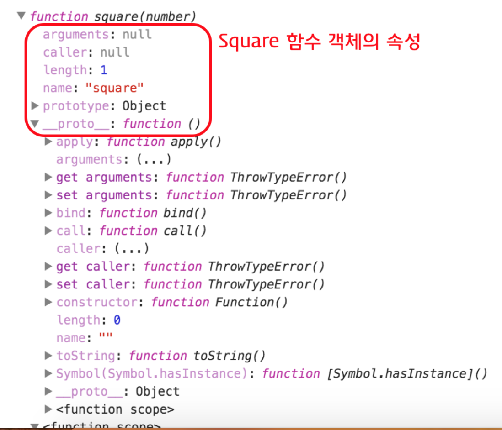
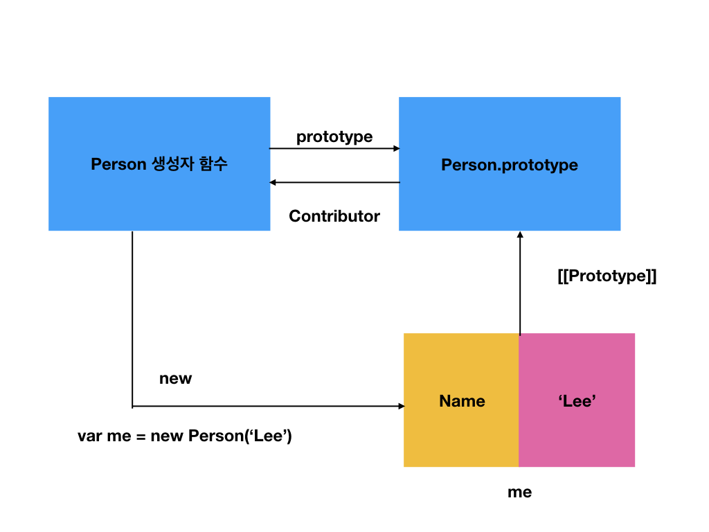

# 5주차 - 180604(월)

new 연산자로 객체를 생성 -> 그 결과물을 인스턴스라고 한다.
객체 리터럴 방식이 있으니, 내부적으로 할당만 하면 쓸 수 있다.

메모리에 있는 실체를 강조할 때 인스턴스라고 함
평상시에는 객체

객체는 원래 '데이터들이 어떤 프로퍼티로 구성되어 있다'라는 의미와 데이터 타입 할 때 객체, 이렇게 여러 의미를 포함하고 있다.

---
함수 정의하는 세가지 방법
1. 함수 선언식
2. 함수 표현식
3. function() 생성자 함수

1,2의 차이점은 함수 호이스팅
1은 함수 호이스팅 방식. 선언 이전에 호출해도 가능하다.
2는 변수 호이스팅 방식. 선언문 이전에 호출하면 에러난다. undefined 호출한 것과 같다.

더글라스 크락포드는 2번 함수 표현식을 사용하는 것을 권장. 선언문 이전에 참조해도 참조되지 않으니 꼬이지 않는다. 

**그것보다 더 좋은 것은 선언 이전에 호출하지 않는 것! 정석대로 사용하는 것**

---
## 매개변수(Parameter, 인자)

function (p1, p2) {
  console.log(p1, p2);
}

여기서 p1은 매개변수라고 선언해주는 것. (매개변수는 지역변수다. 함수 밖에 p1을 호출해도 파라매터는 지역변수라 호출되지 않음.)
값이 할당되는 것은 argument 인수!

---
## Call-by-value

Primitives인수는 Call-by-value(값에 의한 호출)로 동작한다. 
객체와 기본자료형 인수는 메모리 할당되는 방식이 다르다.
객체는 mutable value
기본자료형은 immutable value 값을 재할당하면 새로 메모리를 할당하고 포인터를 바꾼다.

Primitives(기본자료형) 인수는 Call-by-value(값에 의한 호출)로 동작한다. 이는 함수 호출 시 기본자료형 인수를 함수에 매개변수로 전달할 때 매개변수에 값을 복사하여 함수로 전달하는 방식이다. 이때 함수 내에서 매개변수를 통해 값이 변경되어도 전달이 완료된 기본자료형 값은 변경되지 않는다.

```
function foo(primitive) {
  primitive += 1;
  return primitive;
}

var x = 0;

console.log(foo(x)); // 1
console.log(x);      // 0
```
x가 primitive에 '값이 복사된다' == 값으로 할당 == call by value

---
## Call-by-reference

그렇다면 변수는?
객체는 재할당했다고 표현하지 않음. '재할당'하였다고 표현한다.
객체는 address를 주기 때문에(참조값을 복사하기 때문에) 함수 내부에서 바뀌면 함수 밖에서도 바뀐다. 
(이것을 사이드 이펙트가 있다고 말한다. 함수형을 공부하라. 사이트 이펙트를 없애는 것. 큰 프로그램을 다루다보면 의도치 않게 객체가 언제, 누가 바꿨는지도 모르게 계속 바뀌게 될 수도 있다. 그래서 함수를 공부해라. 얼려서 복사하는 것으로 사용하도록)

---
## 반환값

함수는 자신을 호출한 코드(콜러)에게 수행한 결과를 반환한다.
함수값을 리턴했는데 변수로 안받아주면 날아가는 것. 받아줘야 한다.

리턴을 두번할 수는 없다.
이 두개의 데이터를 어떻게 묶을지가 자료구조의 부분인 것
복수의 값을 리턴해야할 때는 반드시 자료 구조로 묶어야 한다.
묶을 때 array로 많이 묶고 for문을 돌린다. 순회라는 것은 순서가 보장되고, 개수가 있다는 뜻

---
## 함수 객체의 프로퍼티

함수는 객체다. 함수도 프로퍼티가 있다.
없는 프로퍼티에 할당하면 동적으로 할당된다.

```
function square(number) {
  return number * number;
}

square.x = 10;
square.y = 20;

console.log(square.x, square.y);
```


```
function square(number) {
  return number * number;
}
console.dir(square);
```

함수는 일반 객체와는 다른 함수만의 표준 프로퍼티를 갖는다.
객체의 내부까지 들여다 볼 수 있는 것이 console.dir. 그러나 비표준이다. chrome이 지원하는 것이기 때문에 크롬이 아니면 안될 수도 있다. 

이 함수는 전역함수다. 
함수.length는 매개변수의 길이


---
## function의 arguments 프로퍼티

아규먼트 객체는 원래 함수가 가지고 있는 객체.

```
function multiply(x, y) {
  console.log(arguments);
  return x * y;
}

multiply();        // {}
multiply(1);       // { '0': 1 }
multiply(1, 2);    // { '0': 1, '1': 2 } // 정상할당
multiply(1, 2, 3); // { '0': 1, '1': 2, '2': 3 }
```

multiply();        // {}
일대일 매핑파는 식으로 할당을 해야하는데
값이 없으면 x도 y도 undefined.
undefined * undefined = NaN이 리턴된다

multiply(1);       // { '0': 1 }
x에 1이 할당, y는 undefined

multiply(1, 2);    // { '0': 1, '1': 2 } 
정상할당

multiply(1, 2, 3); // { '0': 1, '1': 2, '2': 3 }

아규먼트 객체를 들여다보면 어떤 객체가 넘어왔는지 알 수 있다.
그래서 인수를 할당하지 않거나, 파람미터보다 많이 할당할 때에도 아규먼트 객체로 알 수 있다.

객체는 순서를 보장하지 않는다. 순서를 보장하는 자료는 배열이다. 객체를 그래서 포문으로 돌리면 순서가 보장되지 않기 때문에 의도한 대로 동작하지 않을 가능성이 있다. 

multiply(1, 2, 3); // { '0': 1, '1': 2, '2': 3 }
오! 문자열이지만, 프로퍼티의 이름이 순서를 가지고 있다.
이런 식으로 함수를 만드는 것은 유사배열객체. 순회할 수 있다. 프로퍼티에 순서를 담고 있으니까. 

프로퍼티를 내부에서 참조할 수 있다. 

---
## 함수 객체의 legnth 프로퍼티

프로퍼티의 개수

함수는 기명 -> 자기자신을 호출..?
함수는 익명 -> name프로퍼티 null. 

function Person(name) {
  this.name - name;
}

연산에 대상이 있다.

var me = new Person('lee')

---
## __proto__ 프로토타입 프로퍼티

생성자 함수는 객체를 만들어내는 놈이다.

모든 프로퍼티는 부모역할을 하는 객체를 가진다.

두개 패턴이 나왔는데, 

(다시 정리할 것..!)

---
## 함수의 다양한 형태

1. 즉시호출함수표현식 (IIFE, Immediately Invoke Function Expression)

함수의 정의와 동시에 실행되는 함수. 최초 한번만 호출되며 다시 호출할 수 없다. 이러한 특징을 이용하여 최초 한번만 실행이 필요한 초기화 처리 등에 사용할 수 있다.

함수를 선언하고 바로 호출한다.()를 붙여서. 그리고 소괄호로 전체를 묶어주면 됨. 이름이 있든 없든 상관없다. 만약 파라매터가 있으면 호출할 때 인수도 전달해야 한다.

자스의 큰 단점 중 하나는 파일이 분리되어 있다해도 글로벌 스코프가 하나이며 글로벌 스코프가 선언된 변수나 함수는 코드 내의 어디서든지 접근이 가능하다. 즉, 모듈화를 지원하지 않는다. 자스의 가장 큰 약점. 어플리케이션을 개발하는 언어에게는 부적합. a.jx, b.jx파일 안에 똑같이 var x;를 선언하면 중복선언한 것처럼 인식되기 때문.

2. 내부함수

함수는 리턴을 하도록 설계되어있다. return을 설정해주지않으면 undefined를 리턴한다.
중복을 방지하고 변수를 빨리 쓰고 버리기위해 인위적으로 scope를 만들어준다.

3. 콜백 함수 (Callback function)

콜백함수는 함수를 명시적으로 호출하는 방식이 아니라 특정 이벤트가 발생했을 때 시스템에 의해 호출되는 함수를 말한다. 대부분 비동기처리에 사용. 


---
# 프로토타입

---
## 프로토타입 객체



---

function.prototype(조상) -> Person 생성자 함수
Object.prototype(조상) -> Person.prototype

Person 생성자 함수는 function생성자 함수가 만들었다. 

[hasownproperty](https://developer.mozilla.org/en-US/docs/Web/JavaScript/Reference/Global_Objects/Object/hasOwnProperty)를 구글에서 검색

객체가 프로퍼티를 찾을 때 자신에게 먼저 찾는다. 위로 올라가지 않고. 만약에 me.hasownproperty로 하면 찾아서 없으면 올라가고, 거기서 없으면 올라가고, 조상에게서 못찾으면 못찾는 것. -> prototype chian이라고 한다.

static method, prototype method

모든 객체의 조상은 Object.prototype이다. Object.prototype이 prototype chain의 정점이다. 정점까지 가도 못찾으면 내는 것이 reference error.

```
var student = {
  name: 'Lee',
  score: 90
}

// Object.prototype.hasOwnProperty()
console.log(student.hasOwnProperty('name')); // true
```
student는 오브젝트 생성자를 가지고 만들었다(어떻게 앎??)
그래서 student위에는 object.prototype이 있는 것. 

(녹음시작)


```
var person = {
  name: 'Lee',
  gender: 'male',
  sayHello: function(){
    console.log('Hi! my name is ' + this.name);
  }
};

console.dir(person);

console.log(person.__proto__ === Object.prototype);   // ① true
console.log(Object.prototype.constructor === Object); // ② true
console.log(Object.__proto__ === Function.prototype); // ③ true
console.log(Function.prototype.__proto__ === Object.prototype); // ④ true
```
인스턴스가 있다. 이름은 person. 프로퍼티를 3가지 가지고 있음

person의 부모는 Object() 생성자함수가 constructor다.(new 로 만든 것)
Object.prototype이 prototype의 종점


---
객체 리터럴을 통해 만들어진 프로토타입과 생성자 함수를 통해 만든 프로토타입. 뭐가 다를까?(중요, 핵심)
중간 쿠션을 만든 이유, 메서드 중에 동일한 프로퍼티를 가진 것이 있으면 중간 쿠션에 두면 상속받아서 쓸 수 있기 때문. 메모리도 적게 들고 구조적으로도 안정됨

this가 person이 만들 객체.  this로 sayHello프로퍼티를 할당하는 것을 지우고
```
Person.prototype.sayHello = function(){
  console.log('Hi! my name is ' + this.name);
};
```
를 쓰면 된다. 

---
프로토타입을 쓰지 않아도 동작은 똑같다. 그러나 메모리, 구조적 면에서 차이가 난다. 조금의 차이가 그 사람의 수준이 달라진다. 
클래스 기반보다 훨씬 단순하다.

---
용어를 명확하게 이해하고 있으면 어렵지 않다. 

---
```
var str = 'test';
console.log(typeof str);                 // string
console.log(str.constructor === String); // true
```
엥??? string은 기본자료형인데 str 리터럴의 constructor는 String객체를 만드는 생성자라고 한다.
왜 그런가?
new Object('Hello');를 입력하면 
new String('Hello');으로 인식한다.

string뿐만 아니라 모든 기본자료형은 생성자 함수가 있다. 이것을 refer함수라고 한다.

```
console.log(str.toUpperCase());    // TEST
```
str.toUpperCase는 어디있어야할까? 어디서 왔을까? 이것이 성립하려면 객체에 소속되어야 한다. String.prototype에 들어 있는 것. 

자스는 빌트인 함수들이 있다. 만약 빌트인 함수가 없으면 toUpperCase 함수를 하나하나 만들어야 한다
```
function toUpperCase(targetString) {
  대문자화 하는 로직
};
toUpperCase('Hello');
```
이 방법 밖에 없다.

내부적으로 기본자료형에.을 찍는 순간 wrapper객체를 실행하여 자스가 내부적으로 메서드를 실행할 수 있도록 돕는다. 그리고 이 코드가 끝나면(console.log(str.constructor === String);), 다시 기본자료형으로 돌려놓는다.

---
mdn에서 메서드를 찾아보고 만들어도 늦지 않다.
아무런 쓸모없는 일을 한 것.

---
기본 자료형은 메서드를 사용하려고 하면 순식간에 wrapper객체를 사용하여 객체로 변한다.
그러나 메서드를 추가하면 에러는 나지않지만 동작하지는 않는다. 하지만 String 객체의 프로토타입 객체 String.prototype에 메소드를 추가하면 기본자료형, 객체 모두 메소드를 사용할 수 있다. 그러나 다른 사람들에게 노출되므로 추천하지 않음.

---
## 프로토타입 객체의 변경

객체를 생성할 때 프로토타입은 결정된다. 결정된 프로토타입 객체는 다른 임의의 객체로 변경할 수 있다. 이것은 부모 객체인 프로토타입을 동적으로 변경할 수 있다는 것을 의미한다. 이러한 특징을 활용하여 객체의 상속을 구현할 수 있다.

우리가 지금까지 배운 자바스트립트는 환경에 구애받지 않는 것을 배웠다. 브라우저를 떠난 환경에서도 동작하는 스펙.

브라우저 혼경에서만 동작하는 것. 예를 들어 DOM은 html이 없으면 의미가 없다.

---
## Error

자스에서 에러 처리를 어떻게 할까?
자스는 비동기함수로 로직을 처리하는 경우가 대다수이다.
비동기로 처리할 때는 에러처리가 안된다고 할 수 있다. 거기에 따른 새로운 방식들이 매번 추가된다. 예전에는 콜백 방법을 사용해서 비동기 방식을 처리했는데, 에러 처리가 되지 않음

-> ES6에 promise, generator
-> 요즘은 rx.js를 사용해서 처리

지금 비동기처리 방식에서 에러 처리하는 것이 과도기 단계.

try, catch를 사용해서 에러를 사용하도록 처리했는데,
비동기방식에서는 try-catch가 동작하지 않음
(그냥 이런 방법이 있다는 정도만 알아두자.)

---
## 기본자료형과 래퍼객체

왜 이러한 문법을 만들었을까?

---
## 호스트 객체

표준은 아니지만 브라우저 환경에서 동작하는 객체들.


---
## 전역객체

전역변수는 전역객체의 자식이다. 전역함수도 윈도우 객체의 자식이다. 그래서 window가 생략가능한 것. 

---
## 전역프로퍼티

어디서든 접근할 수 있기 때문에 보안상 위험. 무엇인지 알 정도로만 알아놓으라.
- Infinity
- NaN
- undefined

---
## 전역 함수(Global function)

- eval()
- isFinite() : 유한수인지 아닌지 판별하여 boolean값 전달
- inNaN : 숫자인지 아닌지 판별하여 boolean값으로 전달
- parserFloate() : 자스에서 숫자는 모두 실수.
- parseInt() : 16진수(열 여섯개의 digit으로 숫자를 표현. 16이 두 개 있는것) 0x20 -> 10진수 32
- encodeURI() : 매개변수로 전달된 URI를 인코딩한다.(URI 문자들을 이스케이프 처리한다. = 네트워크를 통해 정보를 공유할 때 어떤 시스템에서도 읽을 수 있는 ASCII character-set으로 변환하는 것.)

Port : port 라는 번호를 주어서 서버에 번호를 매겨주는 것. (http 방식도 공부하라) 서버가 없으면 기본적으로 80이 날아간다. 

Path : 그 뒤에 /javascript 뒤부터는 루트폴더에서 시작하는 서버의 폴더구조. 

Query Parameter : key=value로 구성되어 있음

Fragment : 내부링크 안에서 이동. 페이지는 변하지 않고 #id_name 으로 쓰는데 페이지 이동 없이 저 아이디 이름으로 이동하라는 뜻.(유일!)

---
## DOM(Document Object Model)

문서 객체 모델.

---
## BOM(Browser Object Model)

window : 현재 브라우저 창 또는 탭
  - document : 현재 로드된 웹페이지
  - history : 브라우저 히스토리에 기록된 웹페이지(reload를 통해 이전페이지, 뒤로가기)
  - location : 현재 페이지 URL
  - navigator : 브라우저 관련 정보
  - screen : 장치의 디스플레이 정보

---
## Method 배우는 법

경력자와 비경력자의 차이는 Method를 써봤느냐 안써봤느냐라고 할 수도 있을 것이다. 단편적인 정보를 찾아주는 메서드는 찾아보면 다 있다. 그것을 조합해야 한다. 조합하려면 찾아봐야 하고 찾아보려면 이것이 prototype인지 static method인지를 알아야 한다. 이건 혼자 해야 할 몫이다.

만약 string method를 배우면 강사님이 문제 내 주시는 것을 오늘 배운 것에서 method를 찾아서 문제를 푸는 방식으로. 사실 이런 연습을 한달정도 해야 감이 온다.

코딩 능력보다는 어떻게 접근하느냐. 이것도 중요하지만 앞으로 공부해야할 것은 이제 손으로 익혀야 한다. 내일은 string, date, number!
프로토타입에 대해 복습하고 예제들을 한번씩 쳐서 동작을 확인하고 온다. 